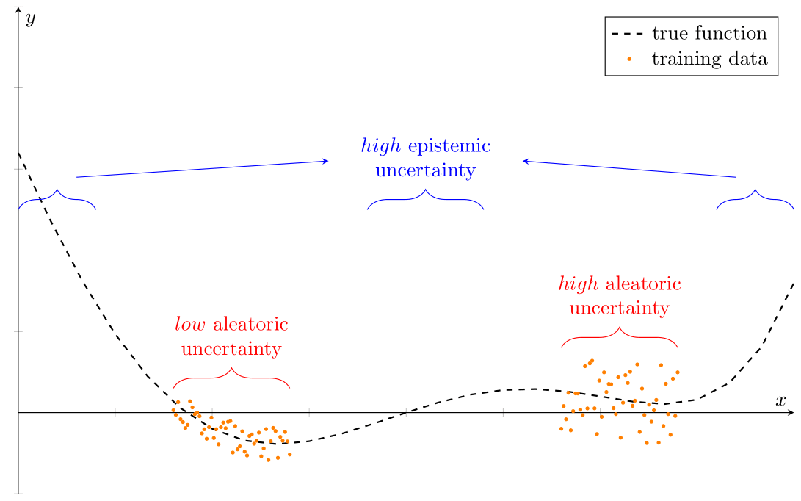

# Uncertainty

## Aleatoric vs. epistemic uncertainty
```{tabbed} Example 1D data


Regression problem with regions of altering aleatoric uncertainty in the data and areas without data.
```

```{tabbed} Gaussian process for various scenarios


Regressing $ with a Gaussian process for different scenarios. In the lower-left, there is low noise in the data. In the lower-right, we do not observe data for a subset of the input range. The upper graphs depict the scenarios as below but with increased noise in the data.
```

### Aleatoric uncertainty
```{margin}
Aleatoric uncertainty = inherent **noise** in the data
```
Aleatoric uncertainty is an **inherent feature of the data** generating process (DGP).
This type of uncertainty reflects noise in the observations, e.g., measurement errors in the data or sensor noise.
It is independent of the amount of data we collect.
For example, we cannot predict the realization of the measurement error of a thermometer.

The noise in the observations can be either *homoscedastic* or *heteroscedastic*.
Homoscedastic noise is constant for all inputs, in the sense that the variance of the noise-generating random process does not change.
Heteroscedastic noise implies that the variance of the noise differs for inputs.

### Epistemic uncertainty
Epistemic uncertainty or model uncertainty refers to **uncertainty in the model parameters** and is a property of the model \parencite{kendallgal2017}. I.e., multiple model parameters may "explain" the data obtained so far. Observing further data, then shrinks the set of possible explanations / parameters significantly.
That is, the more data points are available, the lower the uncertainty in the model parameters.
We can explain away epistemic uncertainty with data \parencite{kendallgal2017}.

```{rubric} References
```

```{eval-rst}
.. [1] Klimm M, Warode P (2021) Parametric Computation of Minimum Cost
       Flows with Piecewise Quadratic Costs. *Mathematics of Operations
       Research*. Available at https://www3.math.tu-berlin.de/disco/research/publications/pdf/KlimmWarode2021.pdf
```

[1]: http://somewebsite.org
